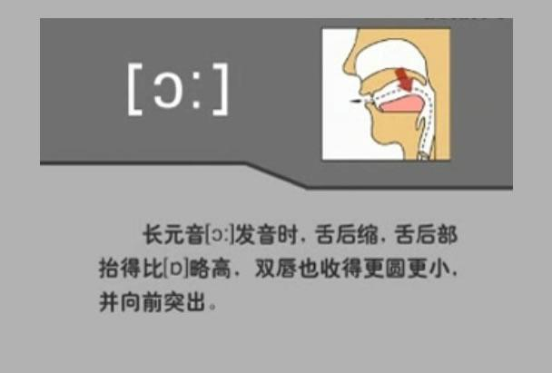

# 48 个国际音标发音指南

# 元音 (20个)

<table><tr><td rowspan="2">单元音</td><td>长元音</td><td>/α: /</td><td>/ɔ: /</td><td>/ɜ: /</td><td>/i: /</td><td>/u: /</td><td></td><td></td></tr><tr><td>短元音</td><td>/ʌ/</td><td>/ɒ/</td><td>/ə/</td><td>/ɪ/</td><td>/ʊ/</td><td>/e/</td><td>/æ/</td></tr><tr><td rowspan="2">双元音</td><td>/ei/</td><td>/ai/</td><td>/ɔi/</td><td>/əʊ/</td><td>/au/</td><td></td><td></td><td></td></tr><tr><td>/ɪə/</td><td></td><td>/eə/</td><td></td><td>/ʊə/</td><td></td><td></td><td></td></tr></table>

# 辅音 (28个)

<table><tr><td rowspan="2">爆破音</td><td>清捕音</td><td>/p/</td><td>/t/</td><td>/k/</td><td></td><td></td><td></td></tr><tr><td>浊捕音</td><td>/b/</td><td>/d/</td><td>/g/</td><td></td><td></td><td></td></tr><tr><td rowspan="2">摩擦音</td><td>清捕音</td><td>/f/</td><td>/s/</td><td>/θ/</td><td>/ʃ/</td><td>/h/</td><td></td></tr><tr><td>浊捕音</td><td>/v/</td><td>/z/</td><td>/ð/</td><td>/3/</td><td>/r/</td><td></td></tr><tr><td rowspan="2">破擦音</td><td>清捕音</td><td>/tʃ/</td><td>/tr/</td><td>/ts/</td><td></td><td></td><td></td></tr><tr><td>浊捕音</td><td>/dʒ/</td><td>/dr/</td><td>/dz/</td><td></td><td></td><td></td></tr><tr><td>鼻音</td><td>浊捕音</td><td>/m/</td><td>/n/</td><td>/η/</td><td></td><td></td><td></td></tr><tr><td>边捕音</td><td>浊捕音</td><td>/l/</td><td></td><td></td><td></td><td></td><td></td></tr><tr><td>半元音</td><td>浊捕音</td><td>/j/</td><td>/w/</td><td></td><td></td><td></td><td></td></tr></table>

# 英语48个音标的快速记忆法

# 元音部分：

1）、单元音：[i:]、[t]、[o:]、[p]、[u:]、[u]、[3:]、[a]、[a:]、[A]、[e]、[a]

2）、双元音：[eI]、[aI]、[OI]、[Ie]、[e]、[u]、[au]、[au]

# 辅音部分：

[p]、[b]、[t]、[d]、[k]、[g]、[f]、[v]、[s]、[z]、[θ]、[δ]、[ʃ]、[ʒ]、[tʃ]、[dʒ][tr]、[dr]、[ts]、[dz]、[m]、[n]、[ŋ]、[h]、[l]、[r]、[j]、[w]

一，单元音：[i:]、[I]、[o:]、[p]、[u:]、[u]、[3:]、[e]、[a:]、[A]、[e]、[a]

[i:]——谐音为：易（yi）；像数字1，记忆真容易.[o:]——谐音为：噢（0）；噢，这个音标就像个o.[u:]——谐音为：雾（wu）；杯子上有很多雾.[a:]——谐音为：饿（e）；鹅倒立着行走就容易饿.[a:]——谐音为：啊（a）；音标的读音跟拼音一样.[e]——谐音为：灭（mie）；我要灭了这只鹅.

二，双元音：[ei]、[ai]、[oi]、[e]、[u]、[i]、[au]、[au]

[ei]——谐音为：妹（mei）；鹅有一个妹妹.

[ai]——谐音为：爱（ai）；音标的读音跟拼音一样.[oi]——这个音标找不到拼音的谐音，可以按照字母o、i连读来进行谐音记忆.[ie]——谐音和外形都像：12[εe]——谐音为：挨饿；外形像3只鹅；三只鹅都在挨饿.[au]——谐音为：傲（ao）；一个杯子很骄傲，不让人拿它喝水.[au]——谐音为：鸥（ou）；一只鹅在杯子里找海鸥.[ue]——谐音为：屋鹅；一屋子的鹅都装在杯子里.

三，辅音：[θ]、[ð]、[ʃ]、[ʒ]

（注：多数辅音的读音与拼音差别不大，可以通过拼音来进行谐音；还有一部分辅音没有对应的拼音字体，我们的记忆方法主要是针对这四个辅音.）其中，[θ]和[ð]这两个音标，它们没有近似的拼音来对应，主要靠嘴形来记忆.[θ]——外形像上下牙齿咬着舌头；[ð]——外形则像舌头顶在上下牙齿之间.而[ʃ]和[ʒ]这两个音标，则可以找到近似的拼音来作为谐音.[ʃ]——谐音为：嘘（xu）；嘘，这里有条很长的蛇，赶快保持安静![ʒ]——谐音为：雨（yu）；外形像3. 今天下了3场大雨.

# 英语四十八个音素发音图解口形及发音方法

# 1.前元音[i]

/1/美式读音符号  /1/英式读音符号  /i/传统式的国际音标读音符号  该音是个前元音，是字母i或y在重读闭音中的读音。它是个短元音，故发此音要短促而轻快。发音要领的是：舌尖抵下齿，舌前部抬高，舌两侧抵上齿两侧，口形偏平。

# 2.前元音[i:]

/i/美式读音符号  /i:/英式读音符号  /i:/传统式的国际音标读音符号

前元音，是字母ea，ee，ie或ei在单词中的发音。此音是长元音，一定注音把音发足。其发音要领是发音时舌尖抵下齿，前舌尽量抬高、舌位高于/i/：口形扁平。

# 3.前元音[e]

/ε/美式发音符号  /e/英式发音符号  /e/传统的国际音标的读音符号

该音是个前元音，是字母e或ea在单词中的发音。它是个短元音。发音时舌尖抵下齿，舌前部稍抬起，舌位比/i:/低；唇形中常，开口度比/i:/大。

# 4.前元音[æ]

/æ/美式读音符号 /æ/英式读音符号 /æ/传统的国际音标的读音符号

该音是个前元素，是字母a在重读闭音节中的发音。/æ/是短元音。发音时舌尖抵下齿；舌前部稍抬高，舌位比/e/更低；双唇平伸，成扁平形。

# 5. 后元音[ɑ:]

/ɑ/美式读音符号  /ɑ:/英式读音符号  /ɑ:/传统的国际音标的读音符号

该音是个后元音，是字母组合ar的读音，也是字母a在ss，st，th等字母前面的读音。/a:/是长元音。发音时口张大，舌身压低并后缩，后舌稍隆起，舌尖不抵下齿。双唇稍收圆

# 6.短元音[o]

/a/美式读音符号  /p/英式读音符号  /o/传统的国际音标的读音符号

该音是个短元音，是字母 o 在重读闭音节单词中的读音。发音时口张大，舌身尽量降低并后缩，双唇稍稍收圆。

# 6. 后元音[0:]

/ɔ/美式读音符号 /ɔ:/英式读音符号 /ɔ:/传统的国际音标的读音符号

该音是个后元音，是字母 o，or，al，oar，our 或 oor 在单词中的发音。它是长元音。发音时舌后部抬得比/ɔ/即美式/ɑ/美式/ɒ/高，双唇收得更圆更小，并向前突出。

 

# 8.后元音[u]

/u/美式读音符号  /u/英式读音符号  /u/传统的国际音标的读音符号

该音是个后元素，是英语字母u，oo或ou等在单词中的发音。/u/是短元音。发音时舌后部抬起，舌身后缩，舌尖离开下齿。双唇收圆，稍突出。

# 9.后元音[

/μ/美式读音符号  /μ:/英式读音符号  /μ:/传统式的国际音标式的读音符号

该音是个后元音，是字母oo或ou在单词中的发音。它是长元音。发音时舌后部尽量抬起，舌位比/u/即美式读音/ʊ/英式读音/ʊ/高。双唇收圆并突出。口形比/u/)/稍小。

# [u:]

发音时，舌后部尽量抬起，舌位比[u]高。双唇收圆并突出。口形比[u]稍小。发音时要保持嘴形不变。

[u:]

[U]

发得稍长口形稍圆

# 10.后元音[^]

/^/美式读音符号  /^/英式读音符号  /^/传统的国际音标的读音符号

该音是个后元音，是字母 o 和 u 在单词中的读音。/^/是短元音。发音时舌尖和舌端两侧轻触

下齿，舌后部靠前部分稍抬起，唇形稍扁，开口度较大，与/3e/相似。

发音时，舌尖和舌端两侧轻触下齿，舌后部靠前部分稍抬起，口形稍扁，开口度较大。

# 11.中元音[θ:]

/3/美式读音符号  /3:/英式读音符号  /θ:/传统的国际音标的读音符号

读音是个中元音，是字母组合er，ir，or和ur在单词中的发音。/θ:/是长元音。发音时舌中部比发/θ/音时略高。双唇扁平。

# [3:]

发音时，舌身平放，舌中部稍抬起，比[θ]略高；牙床开得较窄。双唇向两旁伸开，成扁平形。

# 12.中元音[θ]

/θ/美式读音符号  /θ/英式读音符号  /θ/传统的国际音标的读音符号

该音是个中元音，是字母 a，e，o，u，er，or 和 ur 在单词中的读音。/θ/是读短元音。发音时舌身平放，舌中部略隆起，双唇扁平。

# [e]

发音时，舌身平放，舌中部稍抬起，双唇扁平。

# 13.双元音[ei]

/eI/美式读音符号/eI/英式读音符号/ei/传统的国际音标的读音符号该音是个双元音，是字母a在重读开音节单词中的读音。先发/e/音，然后滑向/i/音。双唇稍扁，口形从半开到合。

# 14.双元音[au]

/au/美式读音符号/ou/英式读音符号/au/传统的国际音标的读音符号

该音是个双元音，是字母o，aa和oe在单词中的读音。它由元音/声/滑向后元音/u/即美音和英音的/u/，舌位由半低到高，口形由半开到小。注意将音发足。

# 15.双元音[ai]

/ai/美式读音符号/ai/英式读音符号/ai/传统的国际音标读音符号

该音是个双元音，是字母i或y在单词中的发音。/ai/为双元音。先发/a/音，然后滑向/i/音。舌尖抵住下齿。发此音的关键是要把/a/音发足，注意从开到合的滑动。

# [aI]

发音时，先发[a:]音，然后滑向[I]音。舌尖抵住下齿。发此音的关键是要把[a:]音发足，注意从开到合的滑动。

# 16.双元音[au]

/aU/美式读音符号/aU/英式读音符号/au/传统的国际音标的读音符号

该音是个双元音，是字母au和ow在单词中的读音。/au/或/aU/由/a/滑向/u//U/。舌位由低到高，口形由大到小。注意将音发足。

发音时，开始部分与[ɑː]中的[ɑː]音相同，由[ɑː]音滑向后元音[ʊ]，舌位由半低到高，口形由大到小，双唇逐渐收圆。注意将音发足。

# 17.双元音[oi]

/ɒɪ/美式读音符号  /ɒɪ/英式读音符号  /ɒɪ/传统的国际音标的读音符号

该音是个双元音，是字母 ɒy 和 ɒi 在单词中的发音。发音时双唇从圆到扁，口形从开到合。发好这个音的关键是首先要把后元音 /ɒɪ/ /ɒ/ /ɒ/ 发足，然后滑向 /ɪ/ 音。

发音时嘴唇从圆到扁，口形从开到合。发好这个音的关键是首先要把后元音[0]发足，然后滑向[1]音。

# 18.双元音[ai]

/ir/美式读音符号  /ta/英式读音  /ai/传统的国际音标的读音

该音是个双元音，是字母ear，ere，eer在单词中的读音。其发音要领是从/i/音滑向/a/音，美音则滑向/r/音。前面的/r/发得较清楚，后面的/a/或/r/较弱。双唇始终半开。此音一定要发足。

# 19.双元音[ε3]

/sr/美式读音符号  /ea/英式读音符号  /ε3/传统的国际音标的读音符号

该音是个双元音，是字母are，air，ear在单词中的读音。其发音方法是从/ε//e/音滑向/ə/音。发间时舌端抵下齿，前舌略抬起，双唇半开，此音中的/ε//有似于/e/音，/ə/音较轻。

# 20.双元音[ua]

/ua/美式读音符号/ua/英式读音符号/ua/传统的国际音标的读音符号

该音是个双元音，是字母our，oor，ure在单词中的读音。发音时，嘴唇从收圆到半开。发好这个音的关键是首先要把/u//u/音发足，然后滑向/a/音。

# 20.双唇爆破辅音[p],[b]

/p//b/美式读音符号/p//b/英式读音符号/p//b/传统的国际音标的读音符号

/p/是p的发音，/b/是b的发音。双唇爆破辅音。发音时双唇紧闭，憋住气，然后突灰分开，气流冲出口腔，发出爆破音。/p/是清辅音，声带不振动；/b/是浊辅音，声带振动。

# 22.舌齿爆破辅音[t],[d]

/t//d/美式读音符号/t//d/英式读音符号/t//d/传统的国际音标的读音符号

/t/是t的发音，/d/是d的发音。舌齿爆破辅音。发音时舌尖抵上齿龈，憋住气，然后突然分开，使气流冲出口腔，发出爆破音。/t/是清辅音，声带不振动；/d/是浊辅音，声带振动。

# 23.舌后软颚爆破辅音[k],[g]

/k/ /g/美式读音符号 /k/ /g/英式读音符号 /k/ /g/传统的国际音标的读音符号

/k/是字母k和字母c的发音，/g/是字母g的读音。舌后软颚爆破辅音。发音时舌后部隆起紧

贴软颚，憋住气，然后突然分开，气流送出口腔，形成爆破音。/k/是清辅音，声带不振动；/9/是浊辅音，声带振动。

# 24.唇齿摩擦辅音[f],[v]

/f//v/美式读音符号/f//v/英式读音符号/f//v/传统的国际音标的读音符号

/f/是f和ph的发音，/v/是v的发音。唇齿摩擦辅音。发音时下唇轻触上齿，气流由唇齿间通过，形成摩擦音。/f/是清辅音，声带不振动；/v/是浊辅音，声带振动。

# 25.舌齿摩擦辅音[θ],[]

/θ/ / /美式读音符号

/θ/ / /英式读音符号

/θ/ / /传统的国际音标的读音符号

/θ// /是 th 的发音。舌齿摩擦辅音。发音时舌尖轻触上齿背，气流由舌齿间送出，形成摩擦音。/θ/是清辅音，声带不振动；/ /是浊辅音，声带振动。

发音时，舌尖轻触上齿背，气流由舌齿间送出，形成摩擦音。发音时声带不振动。

发音时，舌尖轻触上齿背，气流由舌齿间送出，形成摩擦音。发音时声带振动。

# 26.舌齿摩擦辅音[s],[z]

/s/ /z/美式读音符号/s/ /z/英式读音符号/s/ /z/传统的国际音标的读音符号

/s/ /z/是s的发音，/z/又是z的发音。舌齿摩擦辅音。发音时舌端靠近齿龈，气流由舌端齿龈间送出，形成摩擦音。/s/是清辅音，声带不振动；/z/是浊浦音，声带振动。

# 27.舌端齿龈后部摩擦辅音[1],[3]

/5/3/美式读音符号 /5/3/英式读音符号 /5/3/传统的国际音标的读音符号

/5/是sh的发音，/3/是s的发音。舌端齿龈后部摩擦辅音。发音时舌端靠近齿龈后部，舌身抬起靠近上鄂，双唇稍收圆并略突出。气流通过时形成摩擦音。/5/是清辅音，声带不振动；

/3/是浊辅音，声带振动。

# [J]

发音时，舌端靠近齿龈后部，舌身抬起靠近上腭，双唇稍收圆井略突出，让口腔内气流从舌面与上腭间隙缝中挤出时摩擦成音。发音时声带不振动。

# [3]

发音时，舌端靠近齿龈后部，舌身抬起靠近上腭，双唇稍收圆井略突出，让口腔内气流从舌面与上腭间隙缝中挤出时摩擦成音。发音时声带振动。

# 28.声门摩擦辅音[h]

/h/美式读音符号  /h/英式读音符号  /h/传统式的国际音标的读音符号

/h/是字母h的发音。声门摩擦辅音。发音时气流送出口腔，在通过声门时发出轻微摩擦；口形随其后的元音而变化。/h/是清辅音，声带不振动。

# 29.双唇鼻辅音[m]

/m/美式读音符号  /m/英式读音符号  /m/传统的国际音标的读音符号

/m/是m的发音。双唇鼻辅音。发音时软颚下垂，双唇紧闭，气流从鼻腔送出。

# 30.舌尖齿龈鼻辅音[n]

/n/美式读音  /n/英式读音  /n/传统的国际音标的读音符号

/n/是n的发音。舌尖齿龈鼻辅音。发音时舌尖抵上齿龈，软颚下垂，气流从鼻腔送出。

# 31.舌后软颚鼻辅音[']

/美式读音符号  /英式读音符号  //传统的国际音标的读音符号

/是ng的发音。舌后软颚鼻辅音。发音时软颚下垂，堵住口腔通道，气流从鼻腔送出。声带振动。

# 32.舌后软颚半元音[w]

/w/美式读音符号  /w/英式读音符号  /w/传统的国际音标的读音符号

/w/是w的发音。舌后软颚半元音。发音时舌后部向软颚抬起，舌位高。双唇收小并向前突

出，声带振动。发音短促，立刻滑向其后的元音。

# [w]

发音时，舌后部向软腭抬起，舌位高。双唇收小并向前突出，声带振动。发音短促，发音瞬间即滑向后面的元音。

[v]

唇齿摩擦音可以清晰地听出唇齿之间的摩擦。

# 33.舌端齿龈边辅音[I]

/I/美式读音符号  /I/英式读音符号  /I/传统的国际音标式的读音符号

/I/是I的发音。舌端齿龈边辅音。发音时舌尖及舌端紧贴上齿龈，舌前向硬颚抬起，气流从

舌的旁边送出。当此音为尾音时，将舌端抵住上齿龈，舌前下限，舌后上抬，舌面形成凹形。浊辅音、声带振动。

# 34.舌尖齿龈(后部)摩擦辅音[r]

/r/美式读音符号/r/英式读音符号/r/传统的国际音标的符号

/r/是r的发音。舌尖齿龈(后部)摩擦辅音。发音时舌尖卷起，靠近上齿龈后部。舌两侧稍收扰。双唇略突出。气流通过舌尖和齿龈形成轻微摩擦。浊辅音，声带振动。

# 35.舌前硬颚半元音[j]

/y/美式读音符号 /j/英式读音符号

/j/传统的国际音标的读音符号 该音是国音字母γ在词首的读音，是舌前硬颚半元音。发音时舌前部向硬颚尽量抬起，舌位较高，双唇伸展成扁平状。它是个浊辅音，声带振动。

# [j]

发音时舌前部尽量向上腭抬起，舌位较高，双唇伸展成扁平状，声带振动。发音瞬间即滑向后面的元音。

[j] 半元音 双唇自然扁平

[3] 摩擦音 双唇撅起呈圆形

# 36.舌端齿龈破擦辅音[tJ[d3]

/tJ/  $d3/$  美式读音符号/tJ/  $d3/$  英式读音符号/tJ/  $d3/$  传统的国际音标的读音符号

/tJ/是ch的发音，  $d3/$  是dge的发音。舌端齿龈破擦辅音。发音时舌身抬高，舌端抵上齿龈后

部，气流通过时发出破擦音。/t/是清辅音，声带不振动；/d3/是浊辅音，声带振动。

# [t]

发音时，舌尖舌端抬起贴住上齿龈后部，形成阻碍，气流冲破这个阻碍后，舌和齿龈间仍保持一个狭缝。发出摩擦的声音。发音时声带不振动。

# 37.舌端齿龈破擦辅音[ts][dz]

/ts//dz/传统的国际音标读音符号，新课本中美式、英式读音都没将其包括在内，破擦音/ts/、/dz/分别是字母组合ts和ds的读音。舌端齿龈破擦辅音。舌端先贴住齿龈，堵住气流，然后略下降，气流送出口腔。/ts/是清辅音，/dz/是浊辅音。

# 38.齿龈后部破擦辅音[tr][dr]

/tr//dr/传统的国际音标读音符号。新课本中美式、英式读音都没将其包括在内。/tr/、/dr/分别是tr、dr的发音。齿龈后部破擦辅音。发音时舌身与/r/相似，舌尖贴齿龈后部，气流冲破阻碍发出短促的/t/后立即发/r/。/tr/是清辅音，/dr/是浊辅音。

# [tr]

[tr]发音时，舌身与发[r]音时相似，舌尖贴齿龈后部，气流冲破阻碍发出短促的[t]后立即发[r]。发音时声带不振动。

# [dr]

[dr]发音时，舌身与发[r]音时相似，舌尖贴齿龈后部，气流冲破阻碍发出短促的[d]后立即发[r]。发音时声带振动。
